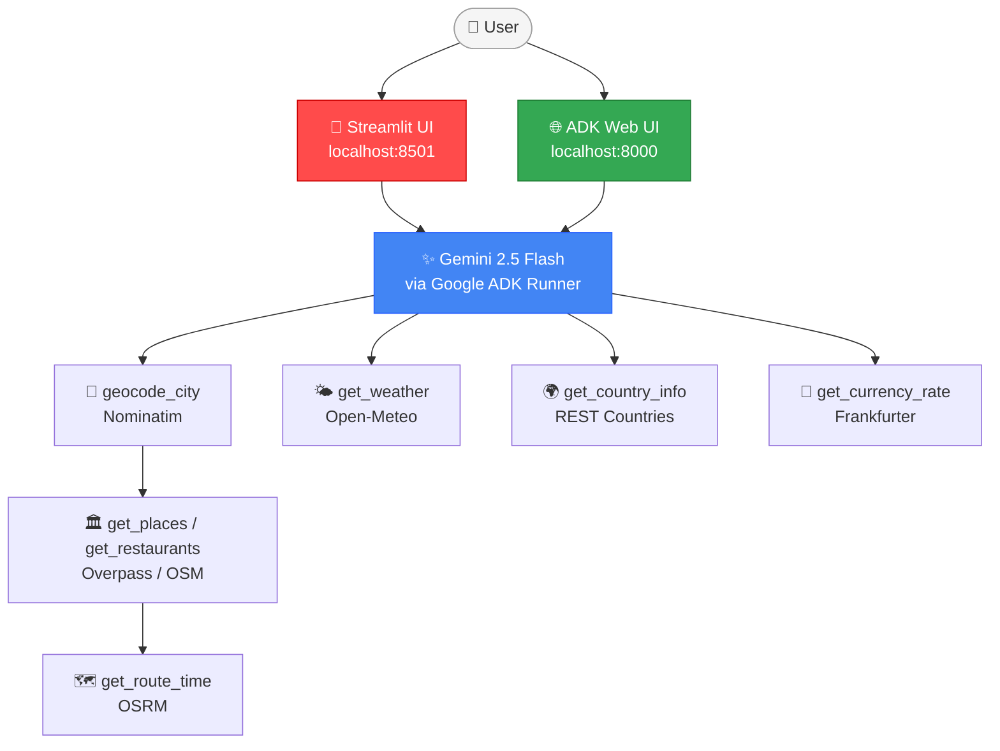

# ✈️ Travel Itinerary Agent

A conversational AI travel planner powered by **Gemini 2.5 Flash** (via Google ADK) and a stack of completely **free, keyless APIs**.


## Features

- **Day-by-day itinerary** — 3–4 themed stops per day with descriptions, tips, and opening hours
- **Interactive route map** — Leaflet map per day with numbered markers and a dashed route line connecting stops in order
- **Live weather** — forecast for each day of the trip via Open-Meteo
- **Budget estimator** — budget / mid-range / luxury daily cost in the destination currency
- **Packing list** — tailored to weather and trip type (beach, hiking, city, etc.)
- **Hotel area suggestions** — best neighbourhoods to stay with price range
- **Country & currency sidebar** — flag, capital, language, timezone, live FX rate
- **Download itinerary** — export as PDF or Markdown
- **Multi-turn chat** — refine the plan ("add more restaurants to Day 2", "what's the weather on Day 3?")

---

## Screenshots

| Landing — 8 quick-start prompts | Barcelona — itinerary with packing list & hotel cards |
|---|---|
|  |  |

| Barcelona — place cards with tips & walk times | New York — 3 days historical |
|---|---|
|  |  |

| Delhi — 2 days | Sydney — 2 days outdoors |
|---|---|
|  |  |

---

## Example prompts

- *"I want to visit New York for 3 days. I love historical places."*
- *"Plan 5 days in Paris focused on art museums and cafés. Show prices in GBP."*
- *"Recommend the best ramen restaurants in Tokyo."*
- *"Plan 3 days in Bali focused on beaches and local culture."*
- *"Plan 4 days in Rome. I love ancient history and architecture."*
- *"Add more restaurants to Day 2."* ← multi-turn follow-up

---

## Setup

```bash
cd travel-agent
make install    # installs uv (if needed) and syncs all dependencies via pyproject.toml

cp .env.example .env
# Edit .env — add your GOOGLE_API_KEY (from https://aistudio.google.com/app/apikey)
```

---

## Running the App

### Option 1 — Streamlit UI (chat interface)

```bash
make ui
```

Open **http://localhost:8502**

Chat interface with collapsible day cards, interactive route maps, weather, country info, live exchange rates, and PDF/Markdown download.

### Option 2 — ADK Web Playground (agent dev console)

```bash
make playground
```

Open **http://localhost:8501** and select the `app` folder.

Google ADK developer console — useful for inspecting tool calls, intermediate steps, and agent traces.

---

## Architecture



The ADK agent runs a tool-use loop. Parallel tool calls (weather + country + currency) are issued in a single agent step.

---

## Deploying to Google Cloud (Vertex AI Agent Runtime)

The app is scaffolded with [`agents-cli`](https://pypi.org/project/google-agents-cli/)
(`agents-cli-manifest.yaml`), deployment target `agent_runtime` — container-based:
`agents-cli deploy` builds an image from `Dockerfile` (`uvicorn app.fast_api_app:app`) and
Agent Runtime hosts it. CI/CD runner: Google Cloud Build. Deployment target: project
`travel-agent-502518`, region `us-west1`, single project used for both staging and prod
(distinguished by `--service-name`).

> **Status in this repo:** the code (`app/`, `Dockerfile`, `agents-cli-manifest.yaml`,
> `deployment/terraform/`, `.cloudbuild/`) is in place, but infra has **not** been
> provisioned — a prior manual `gcloud`-based setup for this project was deleted, and this
> time provisioning goes through Terraform (`agents-cli infra cicd`) instead, so state is
> tracked in a remote GCS bucket rather than being implicit in whatever `gcloud` commands
> someone happened to run.

### Prerequisites

```bash
gcloud auth login
gcloud auth application-default login
gcloud auth application-default set-quota-project travel-agent-502518
gh auth login   # needed for the GitHub <-> Cloud Build connection below
```

### 1. Provision infra + CI/CD

```bash
agents-cli infra cicd \
  --staging-project travel-agent-502518 \
  --prod-project travel-agent-502518 \
  --repository-name travel-agent \
  --repository-owner Sunilrana1978 \
  --cicd-runner google_cloud_build \
  --region us-west1
```

Runs in **plan mode** by default (Terraform plan only, no changes applied) — review the
plan, then re-run with `--apply` to actually provision. This creates the Workload Identity
Pool + provider, a `cicd_runner_sa` with cross-project deploy permissions, the runtime
`app_sa` service accounts, and a remote Terraform state bucket
(`travel-agent-502518-terraform-state`). Connecting the GitHub repo to Cloud Build requires
either a GitHub PAT + App Installation ID (`--github-pat` / `--github-app-installation-id`)
or the `-i` interactive flow, which opens a browser prompt you complete yourself — this is
a real OAuth-style grant, so it isn't something to script unattended.

No Artifact Registry setup needed manually — Agent Runtime builds the container from
source.

### 2. Deploy

```bash
make deploy-staging   # uv run agents-cli deploy --project=travel-agent-502518 --region=us-west1 --service-name=travel-agent-staging --no-confirm-project
make deploy-prod      # ...--service-name=travel-agent-prod
```

Or let CI/CD do it: pushing to `main` triggers `.cloudbuild/staging.yaml` (deploy to
staging, run a load test, then trigger the prod build); `.cloudbuild/deploy-to-prod.yaml`
deploys to prod, gated by Cloud Build's manual-approval step (`gcloud builds list
--filter="status=PENDING"` + `gcloud builds approve BUILD_ID`). Agent Runtime deploys take
5–10 minutes — `agents-cli deploy --no-wait` / `--status` let you start and poll instead of
blocking.

### Auth model

- **Local dev** (`make ui` / `make playground`) uses `GOOGLE_API_KEY` from `.env`.
- **Production** (Agent Runtime) uses Vertex AI ADC / Workload Identity via the
  Terraform-provisioned `app_sa` — no API key needed. `app/agent.py` switches auth
  automatically via `google.auth.default()` + `GOOGLE_GENAI_USE_VERTEXAI=True`.

---

## Free API Stack

| API | Purpose | Key? |
|-----|---------|------|
| Open-Meteo | Weather forecast | No |
| Overpass / OSM | Places, POIs, restaurants | No |
| Nominatim | City → lat/lon | No |
| Frankfurter | Currency exchange rates | No |
| REST Countries | Country info, flag, timezone | No |
| OSRM | Walking/driving times | No |

Only `GOOGLE_API_KEY` is required.

---

## Project Structure

```
app/
  agents/         # Google ADK agent + system prompt (travel_agent.py)
  agent.py        # Vertex AI Agent Engine entry point (root_agent + App, Vertex ADC auth)
  agent_engine_app.py  # Production Agent Engine wrapper (telemetry, GCS, logging)
  tools/          # One file per API (geocode, weather, places, currency, country, routing)
  models/         # Pydantic v2 — Place, ItineraryDay, TravelPlan, etc.
  ui/
    app.py        # Streamlit chat interface with map, cards, sidebar
    export.py     # PDF and Markdown export (fpdf2)
  app_utils/      # Telemetry setup and shared types
tests/
  test_tools.py   # Integration tests for all tool functions (no API key needed)
  test_agent.py   # End-to-end agent test (requires GOOGLE_API_KEY)
.cloudbuild/      # Cloud Build CI/CD — PR checks and staging/prod deploy
```

---

## Running Tests

```bash
make test       # tests/test_tools.py + tests/test_agent.py (test_agent.py needs GOOGLE_API_KEY)
make test-all   # everything, including slower e2e scenarios
```
