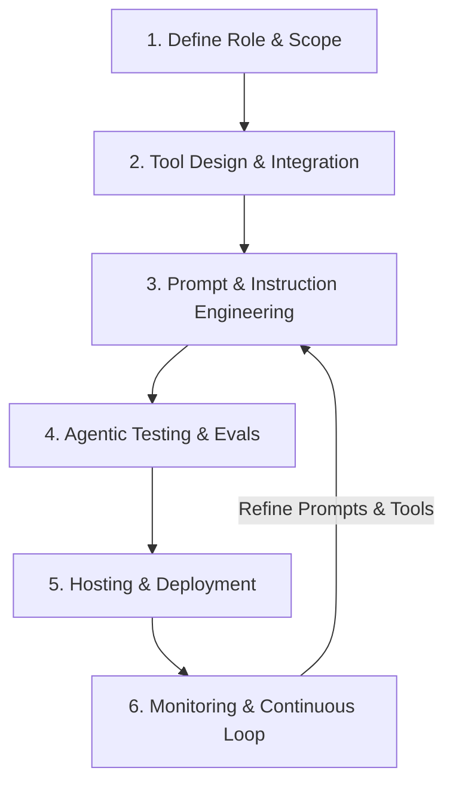

# The Agentic AI Project Lifecycle

Welcome to the world of Agentic AI! Unlike traditional software (which follows rigid procedural flows) or standard LLM chats (which are single-turn text generators), **Agentic AI** involves building autonomous software entities (agents) that can reason, plan, use tools (APIs, databases), maintain state (memory), and interact dynamically to solve complex tasks.

This guide walks you through the end-to-end lifecycle of an Agentic AI project, using this **Travel Itinerary Agent** as a concrete reference.

---

## 🗺️ The 6 Stages of the Agentic Lifecycle



---

### Stage 1: Role, Scope & Constraint Definition
Before writing code, you must define the agent's exact boundaries.
* **Define the Goal**: What is the agent's purpose? (e.g., *“Create a personalized, geographically logical day-by-day travel itinerary.”*)
* **Determine Constraints**: What is the agent forbidden from doing? (e.g., *“Do not output plain text if a structured travel plan is requested; output strict JSON.”*)
* **Determine Output Structure**: Define the schema. In our travel project, we defined a strict JSON layout containing `destination`, `days`, `budget_estimate`, and `packing_list` using Pydantic dataclasses (`src/models/itinerary.py`).

---

### Stage 2: Tool Design & Integration (The Agent's "Hands")
Agents cannot see the real world unless you give them tools. Tools are plain code functions (or APIs) that the agent can choose to execute.
* **Provide Rich Metadata**: When writing python tools, the function's docstring, parameter names, and type annotations are **read by the LLM** to decide when and how to call them.
  * *Example from `src/tools/weather_tool.py`:*
    ```python
    def get_weather(city: str, days: int = 3) -> dict:
        """Fetch weather forecast for a given city..."""
    ```
    The LLM sees this signature and knows: *"If I need weather details, I must call `get_weather` with the parameter `city`."*
* **Handle Failures Locally**: Tools should catch network errors and return clear status dictionaries (e.g. `{"status": "error", "message": "..."}`) rather than letting the agent crash. This lets the LLM reason about the error and reply gracefully.

---

### Stage 3: Orchestration & Instruction Engineering (The Agent's "Brain")
Here, you connect the foundation model to the tools and write the prompt instructions.
* **Select the Model**: Choose a model with strong tool-use and reasoning capabilities (like `gemini-2.5-flash`).
* **Write System Instructions**: The instruction acts as the operating system for the agent. In `src/agents/travel_agent.py`, we instruct the agent:
  1. *First, geocode the city.*
  2. *Next, gather weather, country, and exchange rates in parallel.*
  3. *Then, call places and calculate walk route times.*
  4. *Finally, format the output as JSON.*
* **Manage Memory (Session State)**: In multi-turn systems, the orchestration framework must feed the previous message history back into the model on every new turn.

---

### Stage 4: Agentic Testing & Evals (Validation)
Testing agents is harder than testing normal code because LLM outputs are non-deterministic (they can vary slightly on every run). We structure testing into four tiers:
1. **Tool Integration Tests**: Validate that the external APIs (weather, geocoding) work and return expected schemas (`tests/test_tools.py`).
2. **E2E Scenario Tests**: Test the agent with complete queries and check if the output matches the required JSON structure and logic (`tests/test_e2e_scenarios.py`).
3. **Robustness & Negative Tests**: Feed the agent invalid inputs, mythical places, or garbage inputs to verify that it fails gracefully (replacing JSON structure with plain-text explanations) instead of crashing (`tests/test_robustness_errors.py`).
4. **Evaluations (Evals)**: In commercial apps, developers run hundreds of test cases and use automated "LLM-as-a-judge" scripts to score the output quality (e.g., checking if the walking route order is actually optimized).

---

### Stage 5: Hosting & Deployment
When moving to the cloud, the agent needs a secure, scalable home.
* **Serverless Containerization**: Package the app into a Docker container and host it on a serverless platform like **Google Cloud Run**.
* **Secret Management**: Move API keys out of `.env` files and load them securely using tools like **GCP Secret Manager**.
* **Decoupled Architecture**: While Streamlit is great for prototypes, production systems typically use a modern web frontend (React/Next.js) communicating with a backend API (FastAPI) running the agent.
* **Distributed Session Store**: In-memory session tracking fails when the server scales. Replace it with a persistent database (e.g. **Cloud Firestore** or **Cloud SQL**) to store user chats.

---

### Stage 6: Telemetry, Monitoring & Continuous Improvement
Once live, you enter the operational loop:
* **Trace Execution**: Record every agent action. Look at what tools it called, in what order, how many tokens it consumed, and how long it took. (Tools like **LangSmith**, **Phoenix**, or GCP Cloud Logging are used here).
* **Track Edge Case Failures**: Look for cases where the agent got stuck in a "tool loop" (repeatedly calling a tool with invalid args) or hallucinated invalid JSON.
* **Iterate**: Use these logs to refine your prompt instructions, improve your tool definitions, or provide better examples (Few-Shot Prompting).

---

## 💡 Quick Tips for Beginners
1. **Start with the prompt instruction, not the tools**: Before writing tools, type out your desired instructions and see if the base model can reason through the task on its own.
2. **Keep tools narrow and deterministic**: A tool should do one thing well (e.g., query an API or calculate a math formula). Let the agent handle the creative composition.
3. **Control your token budget**: Parallel tool calling and long conversation histories can quickly bloat your costs. Set caps on chat history length and monitor API usage daily.
