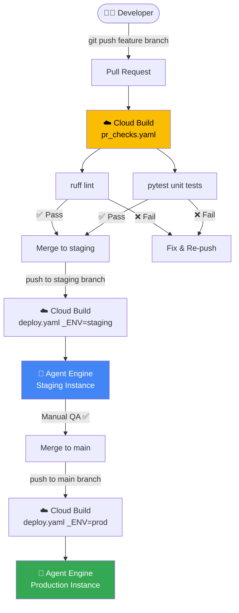

# Travel Agent → agents-cli Migration Plan
## Target: Vertex AI Agent Engine + Google Cloud Build CI/CD

---

## Tool Decision

| | `agent-starter-pack` | ✅ `agents-cli` (chosen) |
|---|---|---|
| Status | 🔴 Maintenance only | ✅ Actively developed |
| Deployment target | `agent_engine` ✅ | `agent_engine` ✅ |
| CI/CD runner | `google_cloud_build` ✅ | `google_cloud_build` ✅ |
| Terraform | Manual `.tf` files | Auto-generated, you never write it |
| Infrastructure command | Manual `gcloud` CLI | `agents-cli infra single-project` |

---

## Full Project Structure: Before vs After

```
BEFORE (current)                        AFTER (migrated)
─────────────────────────────────────   ──────────────────────────────────────────────
travel-agent/                           travel-agent/
├── src/                                ├── app/                          ← RENAMED from src/
│   ├── agent.py                        │   ├── agent.py                  ← REWRITTEN (Vertex AI auth)
│   ├── agents/                         │   ├── agent_engine_app.py       ← NEW (Agent Engine wrapper)
│   │   └── travel_agent.py             │   ├── agents/
│   ├── tools/                          │   │   └── travel_agent.py       ← MOVED, minor edits
│   │   ├── __init__.py                 │   ├── tools/
│   │   ├── country_tool.py             │   │   ├── __init__.py
│   │   ├── currency_tool.py            │   │   ├── country_tool.py       ← UNCHANGED
│   │   ├── geocode_tool.py             │   │   ├── currency_tool.py      ← UNCHANGED
│   │   ├── places_tool.py              │   │   ├── geocode_tool.py       ← UNCHANGED
│   │   ├── routing_tool.py             │   │   ├── places_tool.py        ← UNCHANGED
│   │   └── weather_tool.py             │   │   ├── routing_tool.py       ← UNCHANGED
│   ├── models/                         │   │   └── weather_tool.py       ← UNCHANGED
│   │   └── itinerary.py               │   ├── models/
│   └── ui/                             │   │   └── itinerary.py          ← UNCHANGED
│       ├── app.py                      │   ├── ui/
│       └── export.py                   │   │   ├── app.py                ← UNCHANGED
├── tests/                              │   │   └── export.py             ← UNCHANGED
│   ├── test_tools.py                   │   └── app_utils/               ← NEW directory
│   ├── test_agent.py                   │       ├── __init__.py           ← NEW
│   ├── test_e2e_scenarios.py           │       ├── telemetry.py          ← NEW (OpenTelemetry)
│   ├── test_multi_turn_flow.py         │       └── typing.py             ← NEW (Feedback type)
│   ├── test_robustness_errors.py       ├── tests/
│   └── test_ui_exports.py              │   ├── test_tools.py             ← UNCHANGED
├── requirements.txt                    │   ├── test_agent.py             ← UNCHANGED
├── .env                                │   ├── test_e2e_scenarios.py     ← UNCHANGED
├── .env.example                        │   ├── test_multi_turn_flow.py   ← UNCHANGED
├── .gitignore                          │   ├── test_robustness_errors.py ← UNCHANGED
└── README.md                           │   └── test_ui_exports.py        ← UNCHANGED
                                        ├── .cloudbuild/                  ← NEW directory
                                        │   ├── pr_checks.yaml            ← NEW (lint+test on PRs)
                                        │   └── deploy.yaml               ← NEW (staging+prod deploy)
                                        ├── deployment/                   ← NEW (auto-generated by agents-cli infra)
                                        │   └── terraform/
                                        │       ├── main.tf               ← AUTO-GENERATED
                                        │       ├── variables.tf          ← AUTO-GENERATED
                                        │       ├── outputs.tf            ← AUTO-GENERATED
                                        │       ├── providers.tf          ← AUTO-GENERATED
                                        │       └── backend.tf            ← AUTO-GENERATED
                                        ├── notebooks/                    ← NEW (evaluation)
                                        │   └── evaluation.ipynb          ← NEW
                                        ├── pyproject.toml                ← NEW (replaces requirements.txt)
                                        ├── Makefile                      ← NEW (dev shortcuts)
                                        ├── GEMINI.md                     ← NEW (AI dev context)
                                        ├── .env                          ← UNCHANGED
                                        ├── .env.example                  ← UNCHANGED
                                        ├── .gitignore                    ← UPDATED
                                        └── README.md                     ← UPDATED
```

---

## File-by-File Change Log

### 🟠 RENAMED / RESTRUCTURED

| Old Path | New Path | Change |
|---|---|---|
| `src/` | `app/` | Directory rename — agents-cli convention |
| `src/agent.py` | `app/agent.py` | Rewritten — new Vertex AI auth pattern |
| `src/agents/travel_agent.py` | `app/agents/travel_agent.py` | Moved — import paths updated |
| `src/tools/*.py` | `app/tools/*.py` | Moved — no logic changes |
| `src/models/itinerary.py` | `app/models/itinerary.py` | Moved — no logic changes |
| `src/ui/app.py` | `app/ui/app.py` | Moved — import paths updated |
| `src/ui/export.py` | `app/ui/export.py` | Moved — no logic changes |

---

### 🔴 REWRITTEN: `app/agent.py`

The key change is switching from `GOOGLE_API_KEY` (AI Studio) to **Vertex AI ADC** (Application Default Credentials), and wrapping the agent as an `App` object:

```python
# app/agent.py
import os
import google.auth
from google.adk.agents import Agent
from google.adk.apps import App

from app.agents.travel_agent import SYSTEM_PROMPT
from app.tools import (
    geocode_city, get_weather, get_places, get_restaurants,
    get_currency_rate, get_country_info, get_route_time,
)

# Use Vertex AI ADC instead of GOOGLE_API_KEY
_, project_id = google.auth.default()
os.environ["GOOGLE_CLOUD_PROJECT"] = project_id
os.environ["GOOGLE_CLOUD_LOCATION"] = "global"
os.environ["GOOGLE_GENAI_USE_VERTEXAI"] = "True"

root_agent = Agent(
    name="travel_agent",
    model="gemini-2.5-flash",
    description="Expert travel itinerary planner.",
    instruction=SYSTEM_PROMPT,
    tools=[
        geocode_city, get_weather, get_places, get_restaurants,
        get_currency_rate, get_country_info, get_route_time,
    ],
)

# App object required by Agent Engine
app = App(agent=root_agent)
```

---

### 🆕 NEW: `app/agent_engine_app.py`

The **Agent Engine deployment wrapper** — this is what Vertex AI loads when running in production:

```python
# app/agent_engine_app.py
import os
from dotenv import load_dotenv
import vertexai
from google.adk.artifacts import GcsArtifactService, InMemoryArtifactService
from google.cloud import logging as google_cloud_logging
from vertexai.agent_engines.templates.adk import AdkApp

from app.agent import app as adk_app
from app.app_utils.telemetry import setup_telemetry
from app.app_utils.typing import Feedback

load_dotenv()

class TravelAgentApp(AdkApp):
    def set_up(self):
        setup_telemetry()
        # Use GCS artifacts in production, in-memory locally
        logs_bucket = os.environ.get("LOGS_BUCKET_NAME")
        artifact_service = (
            GcsArtifactService(bucket_name=logs_bucket)
            if logs_bucket else InMemoryArtifactService()
        )
        super().set_up()

    def register_feedback(self, feedback: Feedback) -> dict:
        """Captures user thumbs up/down feedback for evaluation."""
        return {"status": "ok"}

# Instantiate the app — this is what agents-cli deploy uploads
travel_agent_app = TravelAgentApp(agent=adk_app, enable_tracing=True)
```

---

### 🆕 NEW: `app/app_utils/telemetry.py`

OpenTelemetry setup — enables Cloud Trace integration and GCS log capture:

```python
# app/app_utils/telemetry.py
import os

def setup_telemetry() -> str | None:
    """Configure OpenTelemetry and GenAI telemetry with GCS upload."""
    os.environ.setdefault("GOOGLE_CLOUD_AGENT_ENGINE_ENABLE_TELEMETRY", "true")
    bucket = os.environ.get("LOGS_BUCKET_NAME")
    capture_content = os.environ.get(
        "OTEL_INSTRUMENTATION_GENAI_CAPTURE_MESSAGE_CONTENT", "false"
    )
    if bucket and capture_content.lower() == "true":
        # Enable content capture for debugging (staging only)
        pass
    return bucket
```

---

### 🆕 NEW: `app/app_utils/typing.py`

Shared type definitions for the feedback mechanism:

```python
# app/app_utils/typing.py
from typing import TypedDict

class Feedback(TypedDict):
    run_id: str
    score: float  # 0.0 = thumbs down, 1.0 = thumbs up
    comment: str
```

---

### 🆕 NEW: `pyproject.toml` (replaces `requirements.txt`)

`agents-cli` uses `uv` + `pyproject.toml` exclusively:

```toml
[project]
name = "travel-agent"
version = "0.1.0"
description = "AI travel itinerary planner powered by Gemini on Vertex AI"
requires-python = ">=3.10,<3.14"

dependencies = [
    # Core ADK + Agent Engine
    "google-adk>=1.15.0,<2.0.0",
    "google-cloud-aiplatform[evaluation,agent-engines]>=1.130.0",
    # Observability
    "google-cloud-logging>=3.12.0,<4.0.0",
    "opentelemetry-instrumentation-google-genai>=0.1.0,<1.0.0",
    "gcsfs>=2024.11.0",
    "protobuf>=6.31.1,<7.0.0",
    # UI and existing tools
    "streamlit>=1.35.0",
    "httpx>=0.27.0",
    "pydantic>=2.0.0",
    "python-dotenv>=1.0.0",
    "fpdf2>=2.7.0",
    "folium>=0.17.0",
    "streamlit-folium>=0.22.0",
    "google-auth>=2.0.0",
]

[dependency-groups]
dev = [
    "pytest>=8.3.4,<9.0.0",
    "pytest-asyncio>=0.23.8,<1.0.0",
    "ruff>=0.4.6,<1.0.0",
]

[tool.ruff]
line-length = 88
target-version = "py310"

[tool.ruff.lint]
select = ["E", "F", "W", "I", "B", "UP"]
ignore = ["E501"]
```

---

### 🆕 NEW: `.cloudbuild/pr_checks.yaml`

Runs on every **Pull Request** — linting + unit tests (no deployment):

```yaml
# .cloudbuild/pr_checks.yaml
steps:
  - name: "python:3.12-slim"
    id: install-dependencies
    entrypoint: bash
    args:
      - -c
      - |
        pip install uv --quiet
        uv sync --all-groups

  - name: "python:3.12-slim"
    id: lint
    entrypoint: bash
    args:
      - -c
      - uv run ruff check app/ tests/
    waitFor: ["install-dependencies"]

  - name: "python:3.12-slim"
    id: unit-tests
    entrypoint: bash
    args:
      - -c
      - uv run pytest tests/test_tools.py tests/test_agent.py -v
    waitFor: ["install-dependencies"]

options:
  logging: CLOUD_LOGGING_ONLY
```

---

### 🆕 NEW: `.cloudbuild/deploy.yaml`

Runs on push to `staging` or `main` — deploys to Agent Engine:

```yaml
# .cloudbuild/deploy.yaml
steps:
  - name: "python:3.12-slim"
    id: install
    entrypoint: bash
    args:
      - -c
      - |
        pip install uv --quiet
        uv sync

  - name: "python:3.12-slim"
    id: deploy-agent-engine
    entrypoint: bash
    args:
      - -c
      - |
        uv run agents-cli deploy \
          --project=${PROJECT_ID} \
          --region=${_REGION} \
          --env=${_ENV}
    env:
      - "PROJECT_ID=$PROJECT_ID"
    waitFor: ["install"]

substitutions:
  _REGION: us-central1
  _ENV: staging   # overridden per trigger: staging | prod

options:
  logging: CLOUD_LOGGING_ONLY
```

---

### 🆕 NEW: `Makefile`

Developer convenience shortcuts:

```makefile
# Makefile
install:
	@command -v uv >/dev/null 2>&1 || pip install uv
	uv sync --all-groups

playground:
	uv run adk web app/ --port 8501

lint:
	uv run ruff check app/ tests/

test:
	uv run pytest tests/ -v

deploy-staging:
	agents-cli deploy --env=staging

deploy-prod:
	agents-cli deploy --env=prod
```

---

### 🆕 AUTO-GENERATED: `deployment/terraform/` (by `agents-cli infra`)

These files are **generated automatically** when you run `agents-cli infra single-project`. You do not write them — they appear in your repo after the command runs:

```
deployment/terraform/
├── main.tf          ← Agent Engine resources, Cloud Build triggers,
│                       Artifact Registry, GCS buckets
├── variables.tf     ← project_id, region, environment, agent_name
├── outputs.tf       ← agent_engine_url, cloud_build_trigger_ids
├── providers.tf     ← google + google-beta provider config
└── backend.tf       ← GCS remote state (auto-configured)
```

---

## Step-by-Step Migration Commands

### Phase 1 — Local Setup (One Time)
```bash
# 1. Install uv (Python package manager)
curl -LsSf https://astral.sh/uv/install.sh | sh

# 2. Install Terraform (infrastructure engine)
brew install terraform

# 3. Install agents-cli
uvx google-agents-cli setup

# 4. Authenticate GCP
gcloud auth login
gcloud auth application-default login
gcloud config set project YOUR_PROJECT_ID
```

### Phase 2 — Enhance Project (One Time)
```bash
cd /Users/sunilkumar/Downloads/travel-agent

# 5. Tell agents-cli about the existing project
#    This reads current structure and adds scaffolding
agents-cli scaffold enhance \
  --deployment-target agent_engine \
  --cicd-runner google_cloud_build
```
> ✅ This generates: `pyproject.toml`, `Makefile`, `GEMINI.md`, `.cloudbuild/`, `app/agent_engine_app.py`, `app/app_utils/`

### Phase 3 — Migrate Source (One Time)
```bash
# 6. Rename src/ → app/ (manual step)
mv src app

# 7. Update internal imports src.* → app.*
#    (agents-cli enhance may offer to do this)

# 8. Install dependencies
make install

# 9. Test locally
make playground    # opens ADK web UI at localhost:8501
make test          # runs test suite
```

### Phase 4 — Provision GCP Infrastructure (One Time Per Env)
```bash
# 10. Provision all GCP resources via Terraform (auto-applied)
agents-cli infra single-project \
  --project YOUR_PROJECT_ID \
  --region us-central1

# This creates:
# - Vertex AI Agent Engine (staging + prod instances)
# - Cloud Build triggers (PR checks, staging deploy, prod deploy)
# - Artifact Registry repository
# - GCS bucket for logs + Terraform state
# - IAM service accounts + roles
# - Secret Manager entries
```

### Phase 5 — Connect CI/CD (One Time)
```bash
# 11. Wire Cloud Build triggers to your git repo
agents-cli setup-cicd \
  --runner google_cloud_build \
  --project YOUR_PROJECT_ID
```

### Phase 6 — Ongoing Development (Every Code Change)
```bash
# Normal git workflow — Cloud Build handles the rest
git checkout -b feature/my-change
# ... make changes ...
git push origin feature/my-change
# → Cloud Build runs .cloudbuild/pr_checks.yaml (lint + test)

git checkout staging && git merge feature/my-change && git push
# → Cloud Build runs .cloudbuild/deploy.yaml → deploys to staging Agent Engine

git checkout main && git merge staging && git push
# → Cloud Build runs .cloudbuild/deploy.yaml → deploys to prod Agent Engine
```

---

## CI/CD Pipeline Flow (Cloud Build)



---

## Open Questions Before Starting

> [!IMPORTANT]
> Please provide these values before we begin execution:
> 1. **GCP Project ID** — what is your Google Cloud project ID?
> 2. **Region** — `us-central1` (default) or a different region?
> 3. **Single vs Multi-Project** — one GCP project for staging+prod, or separate projects? (Single is simpler to start)
> 4. **Git repo** — is this project in a GitHub/Cloud Source repo that Cloud Build can connect to?
