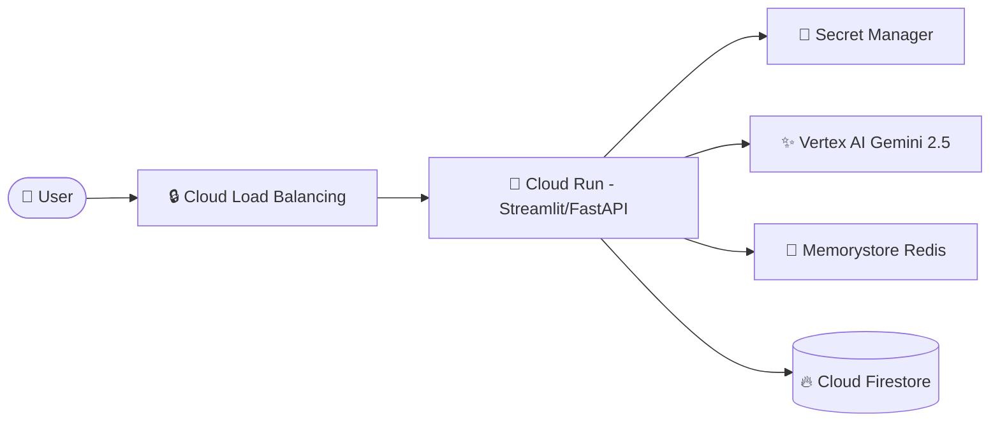

# Production Readiness & Google Cloud Deployment Guide

This document details how to deploy the **Travel Itinerary Agent** on Google Cloud Platform (GCP). It covers two distinct paths:
1. **Cost-Optimized Learning Path (100% Free Tier)** — Optimized for personal learning, prototyping, and zero-cost hosting.
2. **Enterprise Production Path** — Optimized for scale, commercial usage, SLAs, and high traffic.

---

## 💵 Path 1: Cost-Optimized Learning Path (100% Free Tier)

If you are deploying this app to learn the end-to-end cloud process, you can run the entire stack on Google Cloud for **$0/month** by leveraging the GCP Free Tier and free API tiers.

### Architecture Overview
* **Hosting**: **Google Cloud Run** (scales down to 0 instances when idle, incurring zero computing costs).
* **AI Model**: **Gemini Developer API** via Google AI Studio (`GOOGLE_API_KEY`). Requires no credit card and is completely free.
* **Helper APIs**: Your current stack of free, keyless public APIs:
  * *Geocoding*: Nominatim (OSM)
  * *Weather*: Open-Meteo
  * *Places*: Overpass API (OSM)
  * *Routing*: OSRM Public Demo Server
* **Session Persistence**: SQLite (local file-based db) or standard memory state.

### Step-by-Step Cloud Run Deployment Guide

#### Step 1: Enable GCP Services
Open your local terminal (configured with `gcloud`) and enable the required services:
```bash
gcloud services enable run.googleapis.com \
                       artifactregistry.googleapis.com \
                       secretmanager.googleapis.com
```

#### Step 2: Store your AI Studio API Key in Secret Manager
This is a production best practice that prevents hardcoding keys in files or env vars:
```bash
# Create the secret container
gcloud secrets create GOOGLE_API_KEY --replication-policy="automatic"

# Add your key value
echo -n "YOUR_AI_STUDIO_API_KEY" | gcloud secrets versions add GOOGLE_API_KEY --data-file=-
```

#### Step 3: Deploy Directly from Source (No Dockerfile Required)
Cloud Run allows you to deploy directly from your source directory using Google Cloud Buildpacks. It automatically detects the Python requirements and configures Streamlit:
```bash
gcloud run deploy travel-agent \
    --source . \
    --region us-central1 \
    --set-secrets=GOOGLE_API_KEY=GOOGLE_API_KEY:latest \
    --allow-unauthenticated
```
*Note: During execution, Cloud Run will ask if you want to create an Artifact Registry repository. Answer **yes (y)**.*

Once compilation completes, Cloud Run will output a live URL (e.g. `https://travel-agent-xxxxxx.a.run.app`).

---

## 🏢 Path 2: Enterprise Production Path

For commercial applications expecting high concurrent traffic, the free APIs and process-bound session state must be upgraded to support scale, security, and SLAs.

### Production Gaps & Replacements

| Component | Current Implementation | Production Risk | Recommended Production Replacement |
| :--- | :--- | :--- | :--- |
| **State Management** | `InMemorySessionService` | Session loss upon server restart or horizontal autoscaling. | **Cloud Firestore** or **Cloud SQL (PostgreSQL)** |
| **Geocoding** | Nominatim (OpenStreetMap) | Strict 1 req/sec rate limit. IP blocking under load. No SLA. | **Google Maps Geocoding API** |
| **Places / Attractions** | Overpass API (OpenStreetMap) | Slow response times, frequent timeouts, low data freshness. | **Google Places API (New)** |
| **Routing / Walk Times** | OSRM Public Demo Server | Strict rate limits. Explicitly not for production. No SLA. | **Google Routes API** |
| **Caching** | `@lru_cache` (Process-bound) | High memory usage per server. Cache misses on scaled pods. | **Cloud Memorystore (Redis)** |
| **UI Framework** | Streamlit | Not optimized for concurrent multi-tenant loads or custom UX. | **Next.js / React** (Frontend) + **FastAPI** (Backend) |
| **AI API Engine** | Developer AI Studio | Rate limits. Lacks enterprise IAM and security controls. | **Vertex AI Gemini API** |

### Enterprise Cloud Run Architecture



#### Docker Container Setup:
For production builds, use a custom `Dockerfile` to optimize image sizes and caching layers:
```dockerfile
FROM python:3.11-slim
WORKDIR /app
COPY requirements.txt .
RUN pip install --no-cache-dir -r requirements.txt
COPY . .
EXPOSE 8501
CMD ["streamlit", "run", "src/ui/app.py", "--server.port=8501", "--server.address=0.0.0.0"]
```

---

## 📈 Production Checklist

Before launching to live users, verify these 5 operational tasks:

- `[ ]` **Model Redundancy**: Migrate to `gemini-2.5-flash` or `gemini-1.5-pro` running via **Vertex AI APIs** (using Service Accounts for authentication) instead of Developer AI Studio keys.
- `[ ]` **Monitoring & Tracing**: Enable **Cloud Trace** and **Cloud Logging** to capture agent tool execution times and error rates.
- `[ ]` **Horizontal Session Store**: Replace `InMemorySessionService` with **Cloud Firestore Session Service** to prevent user sessions from breaking when Cloud Run scales up.
- `[ ]` **API Budget Constraints**: Configure billing alerts and quota restrictions on your Google Maps Platform account to prevent unexpected charges from run-away loops.
- `[ ]` **Static Exporters**: Clean up `/tmp` files generated during PDF exports or stream them directly as memory buffers (using `io.BytesIO`) rather than writing temporary files to disk.
